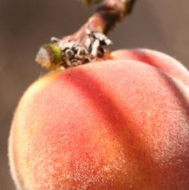

# peachfuzz




Simple Mustache inspired string substitution.

## API

```ts
peachfuzz(template: string, context: Object, transform: Function): string
```

## Usage

```js
var peachfuzz = require('peachfuzz');

peachfuzz('Hello {{name}}', { name: 'Devin' }); //=> 'Hello Devin'
```

`peachfuzz` takes an optional `transform` argument that allows values pulled
from the context to be transformed before substitution:

```js
var peachfuzz = require('peachfuzz');

var template = 'https://swag.shop/?product={{product}}';
var context = { product: 'Moustache Wax' };
peachfuzz(template, context, encodeURIComponent);
//=> 'https://swag.shop/?product=Moustache%20Wax'
```
